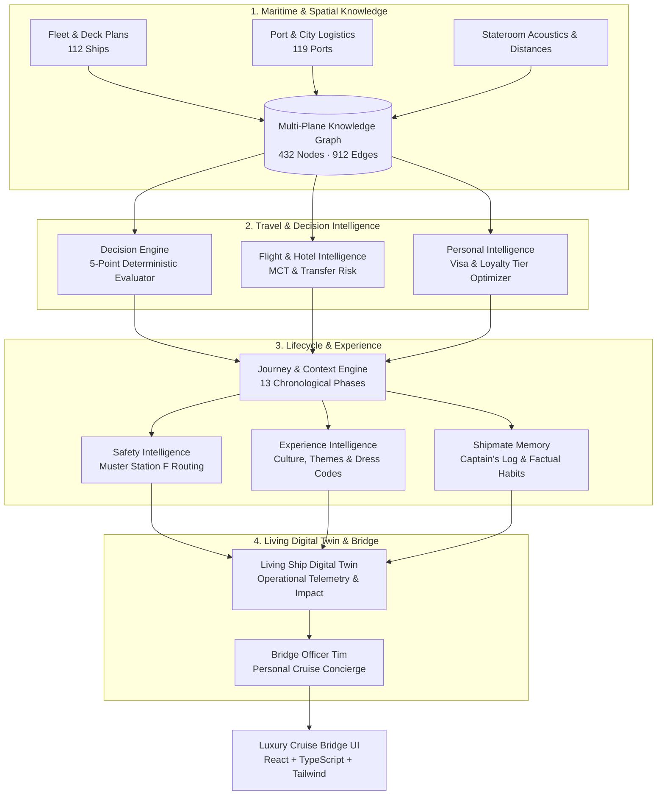

# Timonelo

[](https://github.com/timonelo/timonelo/actions)
[](LICENSE)
[](https://www.python.org/)
[](https://react.dev/)
[](tests/)
[](docs/ARCHITECTURE.md)

> **Timonelo is the personal cruise operating system and living digital twin designed to minimize uncertainty and future regret before, during, and after every voyage.**

---

## Why Timonelo Exists

Modern cruising is complex. A single voyage involves international flights, foreign transit systems, terminal logistics, muster drills, thousands of staterooms, dining reservations, daily dress codes, port clearance, and fluctuating sea conditions.

Most travel applications try to maximize screen time, upsell excursions, or show confusing spreadsheets. 

**Timonelo takes the opposite approach:**

1. **Negative Intelligence First**: We warn against common travel traps (e.g., luggage bottlenecks, airport transfer delays, crowded buffet rushes) before they happen.
2. **Zero Hallucination**: If information is unknown or unverified, it remains explicitly `UNKNOWN`. We never guess taxi prices or boarding gates.
3. **Calm Clarity**: We translate complex AIS telemetries, port regulations, and deck plans into simple, actionable passenger understanding: *"What does this mean for me right now?"*

---

## Bridge Officer Tim (BOT)

**Bridge Officer Tim** is not a chatbot or virtual assistant. He is a calm, experienced bridge officer whose only mission is to help travelers make better decisions before problems occur.

* **He observes quietly**: Continuously monitoring flight connections, pre-cruise hotels, boarding windows, and weather changes.
* **He anticipates**: Preparing solutions hours in advance (e.g., quiet breakfast times, lower theater entrances, wind-protected sunset decks).
* **He respects every traveler**: Never categorizing or judging people, adapting strictly to the objective facts of the voyage.

> *„Certainly. I've already prepared a recommendation for exactly that situation. I remain on the bridge.“*

---

## Architectural Overview

Timonelo is built as an extensible, deterministic multi-plane architecture uniting deep maritime knowledge with real-time operational context:



---

## Quick Start & Developer Experience

### 1. Prerequisites
* **Python 3.11+**
* **Node.js 20+** and `npm`

### 2. Backend & Test Suite Execution
Clone the repository and run the comprehensive test suite (136 unit tests):

```bash
# Clone the repository
git clone https://github.com/timonelo/timonelo.git
cd timonelo

# Run all 136 unit tests
python -m unittest discover -s tests
```

### 3. Canonical CLI Suite
Explore the deterministic engine layers via specialized CLI tools:

```bash
# Living Ship Digital Twin & Operational Translation
python tools/living_ship_cli.py --state bellissima

# Shipmate Memory & Captain's Logbook
python tools/shipmate_memory_cli.py --traveller Florian

# First Voyage Complete Simulation & Readiness (82%)
python tools/first_voyage_cli.py

# Cruise Concierge & Free Time Assistant (2 Hours Free)
python tools/assistant_engine_cli.py --action time2h

# Port & City Intelligence (Yokohama Shore Time Clock)
python tools/port_city_intelligence_cli.py --port yokohama

# Context Briefing Engine
python tools/context_engine_cli.py --phase preparation
```

### 4. Frontend Development & Build
Start the interactive luxury liner console locally:

```bash
# Navigate to frontend directory
cd frontend

# Install dependencies
npm install

# Start local Vite development server
npm run dev

# Build production bundle
npm run build
```

---

## Repository Structure

```
timonelo/
├── .github/                 # CI Quality Gate workflows
│   └── workflows/ci.yml     # Automated Python tests and Vite production build
├── assets/                  # Brand assets, ship photography & silhouettes
├── data/                    # Master compiled knowledge graph database
├── docs/                    # Technical architecture, audits, and specifications
│   ├── ARCHITECTURE.md      # Comprehensive multi-plane engine architecture
│   ├── REPOSITORY_AUDIT.md  # Production readiness and repository quality report
│   └── ...                  # Specialized domain specifications
├── factory/                 # Shipyard data factory for vessel deck plans
├── frontend/                # Interactive React/TypeScript web application
│   ├── src/
│   │   ├── components/      # Luxury bridge dashboards and components
│   │   └── generated/       # Type-safe bridge exports from Python engines
│   └── package.json
├── knowledge/               # Canonical deck plans, cabin facts, and port databases
├── program/                 # Milestone manifests and release trackers
├── src/timonelo/database/   # Core deterministic engines
│   ├── assistant_engine.py      # Cruise concierge, daily missions & quick actions
│   ├── bridge_officer.py        # Bridge Officer Tim daily briefings
│   ├── context_engine.py        # 13-phase journey context & top 3 priorities
│   ├── decision_engine.py       # 5-point deterministic cabin & vessel scorer
│   ├── destination_engine.py    # Port logistics & airport transfer zones
│   ├── experience_intelligence.py # Voyage culture, dress codes & quiet retreats
│   ├── first_voyage_engine.py   # Complete voyage simulation & readiness score
│   ├── flight_intelligence.py   # MCT connection risks & airport hubs
│   ├── global_companion.py      # 8-phase journey & Regret Score engine
│   ├── graph.py                 # Multi-plane Knowledge Graph engine
│   ├── hotel_intelligence.py    # Pre-cruise hotel evaluations & transfer complexity
│   ├── living_ship_engine.py    # Living digital twin & passenger translation layer
│   ├── personal_intelligence.py # Nationality visa rules & status optimizer
│   ├── port_city_intelligence.py# Canonical world port profiles & shore time buffer
│   ├── safety_intelligence.py   # Muster station F routing & context safety
│   ├── shipmate_memory.py       # Captain's logbook, habits & bridge journal
│   └── status_programs.py       # Loyalty tier perks & late check-out guarantees
├── tests/                   # 136 Unit tests with 100% test pass rate
├── tools/                   # CLI companion tools and frontend bridge generator
│   └── generate_frontend_bridge.py # Master export generator into TypeScript
├── FOUNDATION.md            # The 11 Foundational Laws (Product Constitution)
├── LICENSE                  # MIT License
└── README.md                # Project overview and developer guide
```

---

## Core Foundational Principles

Timonelo is governed by the **11 Foundational Laws** outlined in [`FOUNDATION.md`](FOUNDATION.md):

1. **We never invent.** (Unknown remains `UNKNOWN`).
2. **We always explain.** (Every decision is evidence-backed).
3. **We reduce uncertainty.** (Clarity over clutter).
4. **We respect every traveler.** (No assumptions or stereotypes).
5. **We remember journeys, not private lives.** (Travel logistics only).
6. **We translate complexity into calm.** (Passenger-centric meaning).
7. **Software is for people.** (Hospitality before technology).
8. **Every feature must help someone travel with greater confidence.**
9. **Bridge Officer Tim accompanies; he never replaces traveler decisions.**
10. **Hospitality comes before technology.**
11. **We build calm.**

---

## License & Governance

Timonelo is open-source software licensed under the **[MIT License](LICENSE)**.

---

> **„Welcome aboard. The bridge is yours whenever you need it.“** 🚢⚓
