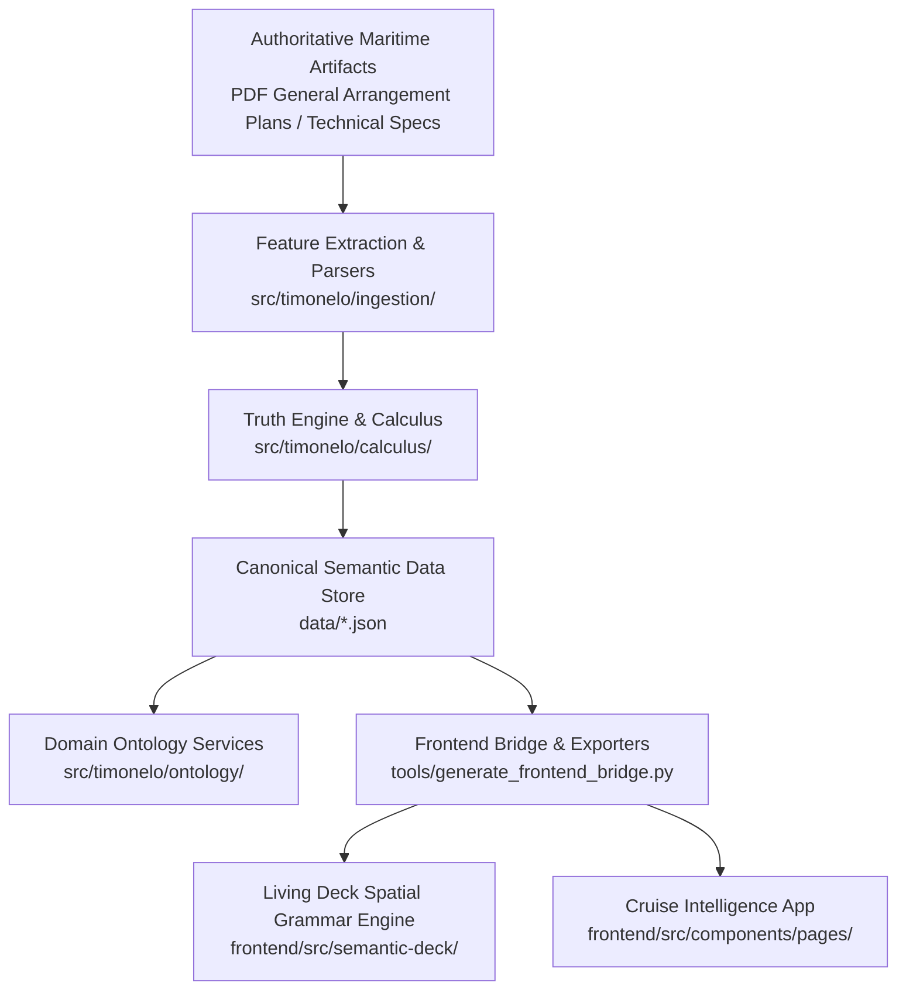

# 02_ARCHITECTURE — Canonical System Architecture & Data Pipeline

## 1. The Canonical Pipeline

The Timonelo platform is organized as a unidirectional, evidence-grounded intelligence pipeline:

---

## 2. Layer Responsibilities & Strict Separation of Concerns

### A. Authoritative Artifacts & Extraction Layer (`src/timonelo/ingestion/`, `evidence/`)
- Ingests official builder plans, ship specifications, and regulatory gazettes.
- Cryptographically hashes source documents with SHA-256 integrity digests.
- Extracts raw statements (`stateroom_number`, `deck_level`, `classification`, `symbol_markers`).

### B. Truth Engine & Epistemic Calculus (`src/timonelo/calculus/`, `src/timonelo/evidence/`)
- Evaluates evidentiary claims against consistency rules.
- Calculates epistemic confidence scores ($0.00 \le c \le 1.00$).
- Resolves conflicts between conflicting historical sources without silent overwrites.

### C. Canonical Data Store (`data/`)
- Version-controlled, deterministic JSON datasets representing normalized ground truth:
  - `data/bellissima_staterooms.json`
  - `data/bellissima_venues.json`
  - `data/andorinha_staterooms.json`

### D. Living Deck Spatial Grammar (`frontend/src/semantic-deck/`)
- Discovers the 4 parallel longitudinal tracks and 5 structural zone blocks directly from graph edges.
- Generates international standard serializations:
  - **W3C BOT (Building Topology Ontology)** (Turtle/RDF)
  - **W3C PROV-O (Provenance Ontology)** (JSON-LD)
  - **OGC IndoorGML** (GML/XML)

### E. Presentation Layer (`frontend/src/`)
- Built strictly with React 19, TypeScript, and TailwindCSS.
- Governed entirely by **Figma Design Freeze v1**.
- Purely consumes semantic data — contains **zero parsing logic, zero heuristic truth inference, and zero hardcoded geometry**.
