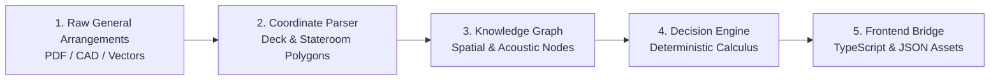

# Shipyard Data Factory & Validation Framework

> **Automated ingestion, deterministic enrichment, and cryptographic validation of naval architectural assets.**

---

## 1. Overview & Purpose

The Timonelo Factory compiles raw shipyard General Arrangements (GA), UN/LOCODE port logistics, and stateroom acoustic matrices into the master living digital twin dataset (`data/cruise_intelligence_db.json`).

---

## 2. Ingestion Pipeline Stages

### Stage 1: Spatial Coordinate Extraction
- Vector distances from stateroom doors to primary/secondary elevator banks.
- Step-free access routes to muster stations and gangways.

### Stage 2: Acoustic & Vertical Sandwich Calculation
- Identification of high-decibel areas (theatres, nightclubs, galleys, engine casings).
- Overlay analysis of deck $N-1$ and deck $N+1$ for every stateroom.

### Stage 3: Port & Harbour Intelligence Verification
- Verification of official harbour master dispatches, UN/LOCODE coordinates, and terminal accessibility.

---

## 3. Tooling & CLI Commands

- `python tools/generate_frontend_bridge.py`: Compiles master database and produces type-safe frontend registries (`fleet.ts`, `ports.ts`, `database.json`).
- `python -m unittest discover -s tests`: Runs 135 continuous deterministic unit tests.

---

*© 2026 Timonelo Naval Architecture & Systems Group.*
