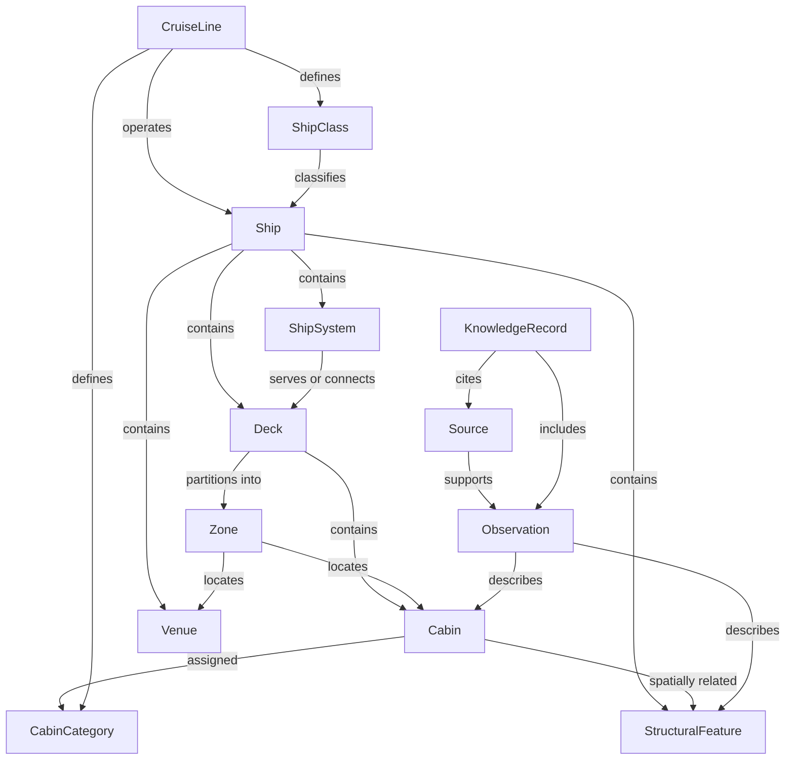

# Canonical Domain Model

## Purpose and authority

This document defines Timonelo's implementation-neutral domain vocabulary. It aligns the DEV-007 scope with the architectural boundaries in [`../architecture.md`](../architecture.md) and the evidence rules in [`../product.md`](../product.md). It is not a database schema, object model, API contract, or commitment to storage technology.

The model intentionally defines meaning, ownership, and conceptual relationships without prescribing fields, cardinalities, serialization, inheritance, or module boundaries. Future approved specifications may refine it; conflicting implementation details do not override it.

## Modeling concepts

### Entity

An entity has continuity and a stable identity independent of its current description. Cruise lines, ships, cabins, observations, sources, and knowledge records are entities because Timonelo must distinguish and reference them over time. Classification as an entity does not imply a database table or mutable object.

### Value Object

A value object expresses a descriptive value and has no independent continuity. Examples include names, labels, positions, evidence qualifications, source citations, and bounded measurements. Equality is based on meaning rather than identity. The model does not prescribe their internal representation.

### Relationship

A relationship is a sourced or derived association between domain subjects. Examples include `member_of`, `contains`, `located_in`, `adjacent_to`, `serves`, and `supported_by`. A relationship may carry provenance or qualification, but it is not automatically an entity. Material relationships with their own evidence history may be represented by an Observation.

### Identifier

An identifier is a stable reference to one entity within an agreed namespace. Identity must not depend on a display name, folder path, supplier code, or database key. The format and assignment mechanism remain specification concerns.

### Enumeration

An enumeration is a controlled vocabulary for a closed, explicitly governed set of meanings, such as an approved lifecycle or review status. Enumerations must not be used for open-ended domain concepts. Their members are defined only by an approved specification or knowledge standard.

## Classification overview

| Concept | Classification | Rationale |
| --- | --- | --- |
| CruiseLine | Entity | Maintains identity while names, fleets, and status may change. |
| ShipClass | Entity | Is a referenced class definition with continuity across member ships. |
| Ship | Entity | Represents one vessel with its own identity and lifecycle. |
| Deck | Entity | Is an addressable structural level within one ship. |
| Zone | Entity | Is an addressable spatial grouping within a ship or deck. |
| Cabin | Entity | Represents one cabin position on one ship. |
| CabinCategory | Entity | Is a governed classification that may change independently of a cabin. |
| StructuralFeature | Entity | Represents an addressable physical feature relevant to spatial evidence. |
| ShipSystem | Entity | Represents an addressable shipboard system relevant to structural context. |
| Venue | Entity | Represents an addressable public or operational space. |
| Observation | Entity | Preserves the identity, provenance, and review history of one evidence statement. |
| Source | Entity | Preserves the identity and provenance of evidence material. |
| KnowledgeRecord | Entity | Provides a reviewed, canonical knowledge boundary with its own lifecycle. |
| Name, position, qualification, citation | Value Object | Describes another concept and has no independent lifecycle. |
| `contains`, `adjacent_to`, `supported_by` | Relationship | Connects subjects without asserting a technical representation. |
| Stable domain reference | Identifier | Establishes continuity without relying on mutable labels. |
| Governed status vocabulary | Enumeration | Restricts a deliberately closed set of operational meanings. |

## Core entities

### CruiseLine

**Purpose:** Represent a cruise line as a stable domain subject.

**Responsibilities:** Maintain the canonical identity of the cruise line and anchor its relationships to ship classes, ships, cabin categories, and supporting evidence.

**Owned Data:** Stable identifier; canonical and recognized names; lifecycle state; provenance for identity-level claims.

**Relationships:** May define ShipClasses and CabinCategories; may operate Ships; may be described by Observations and KnowledgeRecords.

**Lifecycle:** Created when identity is established from sufficient evidence; reviewed as facts change; retained through renaming, merger, or inactive status rather than silently replaced.

**Examples:** A canonical record for one operator, distinct from its brands, vessels, and source documents.

### ShipClass

**Purpose:** Represent a named or otherwise recognized class shared by ships.

**Responsibilities:** Preserve class identity and the evidence-backed criteria by which Ships are associated with it.

**Owned Data:** Stable identifier; canonical name; defining classification facts; lifecycle state; provenance.

**Relationships:** May be defined by a CruiseLine; classifies Ships; may provide context for shared StructuralFeatures or ShipSystems without replacing ship-specific facts.

**Lifecycle:** Established when a class can be distinguished; refined as evidence improves; retained when no active members remain.

**Examples:** A class record referenced by several Ship records while allowing each ship to differ.

### Ship

**Purpose:** Represent one physical vessel as the root of its structural model.

**Responsibilities:** Anchor ship-specific Decks, Zones, Cabins, Venues, StructuralFeatures, ShipSystems, and evidence.

**Owned Data:** Stable identifier; canonical and historical names; ship identity facts; lifecycle state; provenance.

**Relationships:** May be operated by a CruiseLine; may be a member of a ShipClass; contains structural and spatial entities; is described by Observations and KnowledgeRecords.

**Lifecycle:** Established when the vessel's identity is verified; remains continuous through renaming or operational changes; historical states remain traceable.

**Examples:** One vessel represented independently from other members of the same ShipClass.

### Deck

**Purpose:** Represent an addressable structural level of one Ship.

**Responsibilities:** Provide structural and spatial context for Zones, Cabins, Venues, StructuralFeatures, and ShipSystems.

**Owned Data:** Stable identifier within the Ship; canonical designation; ordering or position where evidenced; lifecycle state; provenance.

**Relationships:** Belongs to one Ship; may contain Zones, Cabins, Venues, StructuralFeatures, and ShipSystems; may relate spatially to other Decks.

**Lifecycle:** Created from verified ship structure; revised when authoritative plans change; version differences remain explicit.

**Examples:** A documented ship level used to locate cabins and public spaces.

### Zone

**Purpose:** Represent a meaningful spatial subdivision of a Ship or Deck.

**Responsibilities:** Group spatial subjects without changing their individual identity and support bounded location relationships.

**Owned Data:** Stable identifier within its spatial context; canonical designation; evidenced boundary or location description; provenance.

**Relationships:** Belongs to a Ship and normally a Deck; may contain or overlap the locations of Cabins, Venues, StructuralFeatures, and ShipSystems; may be adjacent to other Zones.

**Lifecycle:** Exists while its definition is supported; boundary revisions require review and must not rewrite historical evidence silently.

**Examples:** An evidenced forward, central, aft, or other named area without prescribing geometry.

### Cabin

**Purpose:** Represent one cabin position on one Ship.

**Responsibilities:** Anchor cabin-specific identity, structural location, category assignments, relationships, and observations.

**Owned Data:** Stable identifier within the Ship; cabin designation; evidenced location; lifecycle state; provenance.

**Relationships:** Belongs to a Ship and Deck; may be located in a Zone; may be assigned a CabinCategory; may be adjacent or otherwise spatially related to Cabins, Venues, StructuralFeatures, and ShipSystems.

**Lifecycle:** Established from verified ship material; category or descriptive changes do not replace its identity; unavailable or retired cabins remain historically traceable.

**Examples:** A single numbered cabin distinguished from its category and from similarly numbered cabins on other ships.

### CabinCategory

**Purpose:** Represent a governed classification applied to cabins.

**Responsibilities:** Preserve the meaning and provenance of a category separately from the Cabins assigned to it.

**Owned Data:** Stable identifier in its governing context; canonical label; evidenced definition; lifecycle state; provenance.

**Relationships:** May be defined by a CruiseLine or in a ship-specific context; classifies Cabins; may be described by Observations and KnowledgeRecords.

**Lifecycle:** Created when a category definition is evidenced; assignments and definitions may change over time; superseded categories remain traceable.

**Examples:** A category definition referenced by multiple cabins without implying that those cabins are structurally identical.

### StructuralFeature

**Purpose:** Represent a physical feature relevant to ship structure or cabin context.

**Responsibilities:** Provide an addressable subject for spatial relationships and evidence without predicting passenger experience.

**Owned Data:** Stable identifier within the Ship; feature kind or name; evidenced location; lifecycle state; provenance.

**Relationships:** Belongs to a Ship; may be located on a Deck or in a Zone; may be adjacent or otherwise related to Cabins, Venues, and other features.

**Lifecycle:** Established from verified structural evidence; revised or retired when ship configuration changes; historical configuration remains distinguishable.

**Examples:** A stair, lift, bulkhead, passage, or other evidenced physical feature represented without asserting its effects.

### ShipSystem

**Purpose:** Represent a shipboard system relevant to structural or operational context.

**Responsibilities:** Maintain system identity and supported relationships while avoiding unsupported operational conclusions.

**Owned Data:** Stable identifier within the Ship; canonical designation or system kind; evidenced scope or location; lifecycle state; provenance.

**Relationships:** Belongs to a Ship; may serve or connect Decks, Zones, Venues, Cabins, or StructuralFeatures; may be the subject of Observations.

**Lifecycle:** Established when sufficiently identified; changes are reviewed as ship configuration evolves; historical observations retain their original context.

**Examples:** An evidenced circulation, access, or technical system recorded only to the level supported by sources.

### Venue

**Purpose:** Represent an addressable public, guest, or operational space on a Ship.

**Responsibilities:** Anchor venue identity, location, and spatial relationships relevant to cabin evidence.

**Owned Data:** Stable identifier within the Ship; canonical and recognized names; evidenced venue kind and location; lifecycle state; provenance.

**Relationships:** Belongs to a Ship; may be located on one or more Decks or within Zones; may be adjacent or connected to Cabins, StructuralFeatures, and ShipSystems.

**Lifecycle:** Created when identity and location are verified; naming or use changes are reviewed; former identities remain traceable.

**Examples:** A documented public area represented as a spatial subject rather than as a promotional description.

### Observation

**Purpose:** Represent one reviewable statement of fact, sourced assertion, or deterministic finding about a domain subject.

**Responsibilities:** Preserve what is asserted, which subject it concerns, its evidence type, provenance, qualification, review state, and known limitations.

**Owned Data:** Stable identifier; subject reference; bounded statement; evidence qualification; lifecycle or review state; provenance and limitations.

**Relationships:** Describes one or more domain subjects; is supported by Sources or an explicit derivation basis; may be included in KnowledgeRecords.

**Lifecycle:** Drafted from evidence, reviewed, accepted or rejected, and superseded when necessary; prior states remain traceable and are not silently strengthened.

**Examples:** A sourced adjacency fact or reproducible spatial finding that states its evidence boundary.

### Source

**Purpose:** Represent evidence material used to support domain claims.

**Responsibilities:** Preserve source identity, provenance, scope, accessibility, supported claims, and known limitations.

**Owned Data:** Stable identifier; title or designation; publisher or origin; reference location; publication and access context when known; review state; limitations.

**Relationships:** Supports Observations and KnowledgeRecords; may describe any domain entity; may be superseded or supplemented by other Sources.

**Lifecycle:** Registered when evaluated for use; reviewed for authority and currency; retained when unavailable or superseded so existing claims remain traceable.

**Examples:** An authoritative deck plan or ship specification represented by metadata and citation rather than copied content.

### KnowledgeRecord

**Purpose:** Represent a canonical, reviewed knowledge artifact about a defined subject.

**Responsibilities:** Organize accepted claims, relationships, sources, uncertainty, and review history without hiding conflicts or missing evidence.

**Owned Data:** Stable identifier; canonical title; record kind; subject reference; lifecycle or review state; bounded summary; provenance and review notes.

**Relationships:** Refers to one or more domain subjects; includes or references Observations; cites Sources; may relate to other KnowledgeRecords.

**Lifecycle:** Drafted, validated, reviewed, approved, revised, and superseded according to knowledge governance; generated indexes do not define its state.

**Examples:** A reviewed ship, cabin, structural feature, or glossary record assembled from traceable evidence.

## Conceptual relationship diagram

The diagram is navigational, not exhaustive. It does not assert database ownership, cascade behavior, aggregate boundaries, mandatory cardinalities, or direction of technical references.

## Relationship overview

| Relationship | Meaning | Evidence rule |
| --- | --- | --- |
| `defines` | Establishes a governed class or category in a stated context. | Must identify the governing context and source. |
| `operates` | Associates a Ship with a CruiseLine for a qualified period or state. | Must not be inferred from naming alone. |
| `classifies` | Associates a Ship or Cabin with a defined class or category. | The classification and its context must be sourced. |
| `contains` | Places a structural or spatial entity within a larger subject. | Must be supported by structural evidence. |
| `located_in` | Locates a subject on a Deck or within a Zone. | Must retain source or derivation provenance. |
| `adjacent_to` | States a qualified spatial adjacency. | Must define the applicable spatial rule and evidence; it does not imply impact. |
| `serves` / `connects` | Associates a ShipSystem with the spaces or subjects it supports. | Must remain limited to the documented function. |
| `describes` | Connects an Observation to its subject. | The observation must preserve qualification and limitations. |
| `supported_by` | Connects an Observation or KnowledgeRecord to evidence. | Unsupported claims are not promoted to canonical knowledge. |
| `includes` | Places reviewed Observations within a KnowledgeRecord. | Inclusion does not remove provenance or uncertainty. |

## Boundary rules

- The model describes domain meaning, not storage or code structure.
- Display names and supplier labels are not stable identifiers.
- ShipClass facts do not automatically become Ship facts.
- CabinCategory facts do not automatically become Cabin facts.
- A spatial relationship does not predict noise, comfort, privacy, motion, or passenger experience.
- Source facts and deterministic findings remain distinguishable.
- Every accepted Observation retains provenance, qualification, and limitations.
- Missing evidence remains missing; a lifecycle change never rewrites prior evidence silently.
- Relationships may be refined by later specifications, but implementations must not invent semantics absent from approved domain rules.

## Deferred decisions

The following remain intentionally undefined: identifier formats, mandatory cardinalities, aggregate boundaries, coordinate systems, measurement units, geometry representation, status members, temporal modeling, source ranking, confidence scales, persistence, serialization, APIs, and module ownership. Each requires a separate approved specification or architecture decision.
